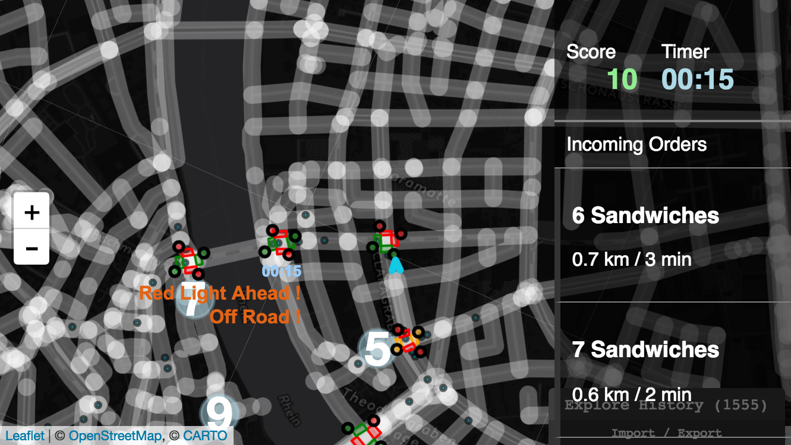

## Sandwich Delivery Game

### The Game

> Welcome to our Sandwich Delivery Game.
>
> In this game, it is your job to deliver sandwiches to small groups of people in the city of Basel.
>
> You earn *10 CHF* for each sandwich delivered but ride carefully: Running a *Red Light* will cost you *60 CHF*. Driving *Off Roads* or not using bicycle lanes when they are present will cost you *30 CHF*.
> You can take up to *2 minutes* for a delivery tour.
>
> Keys: *W*, *A*, *S*, *D* for Forward, Left, Break and Right. *Space* for Select. *H* / *L* for showing/hiding sidebar. *J* / *K* to move up down orders in sidebar.
>
> Press the 'select' button on your right to start.


Mobile phones the controls are:

> Navigation: *Tilt mobile phone* for Forward, Left, Break and Right. *Tap* for Select. *Swipe left* / *right* for showing/hiding orders sidebar. *Tap on order* to select an order in the sidebar.





### General

The game was developed for a show case on the "Smart Suisse" exhibition in Basel, Switzerland. It should demonstrate the integration of modern bike technology with a web application.

The bike was set up with a speed sensor and a mobile phone on top of the handlebars. The mobile phone detected the rotation of the handlebar and, together with the speed sensor, the player was able to move.
An additional controller was part of the bike extension to make navigation during riding easier. The controlls were integrated in the gameplay.

In order to catch the attention of visitors, the screen of the mobile phone was mirrored via a beamer.

The original controls via the bike were removed from the source code.

An article related to this repository can be read [here TODO]().


### Technical

The main view of the game is a map shown with [Leaflet](http://leafletjs.com/). Nearly all elements on the map are drawn by [Elm](http://elm-lang.org/) as well as the main logic is kept in Elm.

Technically is Elm telling Leaflet over ports which map element has been updated and must be redrawn. Only the sidebar and notifications are really drawn by Elm with overlays.


### Build and Serve

The project is based on elm-webpack-starter project by [Peter Morawiec](https://github.com/elm-community/elm-webpack-starter/blob/master/package.json).

* Install all dependencies using the handy `reinstall` script (clean (re)install of all npm and elm packages, plus a global elm install.*):

      ```
      npm run reinstall
      ```

* Serve locally on [http://localhost:8080/](http://localhost:8080/)

      ```
      npm start
      ```

* Build and bundle for production

      ```
      npm run build
      ```

  * Files are saved into the `/dist` folder
  * To check it, open `dist/index.html`


### (Known) Code Smells

* Selection of an order does not have any meaningful effect in the game. There was thought to be a feature but for now it is not even helpful for the gampelay :). But it demonstrates some of Elms capabilities to draw html in a layer on top of the map.

* Playing on mobile phone is only in portrait mode possible.

* Elm code not documented and may sometimes be messy due to exploring the language, but: follow the types :).

* We are definitly not proud of any JavaScript part.


### Notes, Thanks and Licenses

- Own build of leaflet due to rotation requirement: branch rotate in leaflet project used

    https://github.com/Leaflet/Leaflet/tree/rotate


- Map Tiles provided by carto.com (see copy right on map)

    https://carto.com/location-data-services/basemaps/


- Editor used to create objects like Traffic Lights in GeoJSON format

    http://geojson.io/


